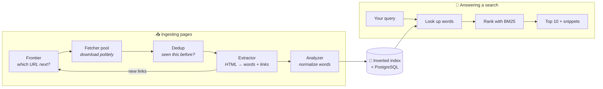

# 🔍 minisearch

**A tiny search engine, built from scratch.** It roams websites the way Google's
crawler does, reads every page it finds, organizes the words into an index, and
answers search queries in milliseconds — all from first principles, with the
performance numbers to prove it.

[](https://github.com/SapnilPatel/minisearch/actions)


```
$ curl -X POST localhost:8080/crawl \
       -d '{"seeds": ["https://books.toscrape.com/"], "max_pages": 200, "max_depth": 2}'
{"status": "started"}

$ curl 'localhost:8080/search?q=historical+fiction'
{"count": 7, "hits": [{"title": "...", "score": 11.2, "snippet": "… historical fiction …"}]}
```

---

## 🧭 What is this, in plain English?

Imagine a librarian hired to catalog every book in a strange, endless library:

1. **🕸️ The crawler** is the librarian's legs — it walks from page to page by
   following links, politely (never hammering one website, always respecting
   the site's "do not enter" signs).
2. **🧠 The dedup filter** is the librarian's memory — "have I already seen
   this page?" — kept in a data structure so compact that remembering 100,000
   pages takes less memory than a single photo.
3. **📇 The index** is the card catalog — instead of storing "page 12 contains
   these words," it stores "the word *dragon* appears on pages 12, 47, and 300."
   Flipping the question around is the one trick that makes every search
   engine fast: to answer a query, you look up the *word*, not every page.
4. **🏆 The ranker** decides order — pages where your words are rare,
   frequent, and central rise to the top (an algorithm called BM25, the same
   family used by real search engines).

Type a query, and minisearch does what Google does in miniature: looks up your
words in the catalog, finds pages containing all of them, scores each one, and
returns the best ten — with a snippet showing your words in context.

## ⚙️ How the pieces fit



Two assembly lines share one card catalog. They're connected by a **bounded
queue** — if indexing falls behind, the crawler automatically slows down
instead of piling up pages in memory. (Engineers call this *backpressure*; it's
why the whole system runs in ~40 MB of RAM.)

## 📊 The numbers

Every claim below is reproducible — each row has a script in [`scripts/`](scripts/)
that measures it, and [METRICS.md](METRICS.md) records the full runs.

| What was measured | Result | In plain terms |
|---|---|---|
| Crawling speed | **~7,400 pages/sec** | a 10,000-page site in under 2 seconds¹ |
| Search speed | **1–13 ms** typical | ~20× faster than a blink |
| Memory for "have I seen this URL?" | **99× smaller** than the naive approach | 100,000 URLs remembered in 117 KiB |
| Filter accuracy vs. its math | **1.02% vs 1.00% predicted** | the theory and the code agree to 2% |
| Database writing, batched vs one-by-one | **36× faster** (56× with COPY) | why real systems batch their writes |
| Indexing speed | **~3,440 docs/sec** | reads + catalogs a novel's text per second |

¹ *measured against a local server — an upper bound on the software's own
overhead; crawling the real web is limited by politeness and network speed.*

## 🛠️ Built from scratch, on purpose

The interesting parts use **no libraries** — each is implemented from first
principles and pinned down by tests:

| Component | What it replaces | Why hand-rolled |
|---|---|---|
| 🌸 Bloom filter | a memory-hungry hash set | 99× less memory; measured accuracy matches the formula |
| 🚦 Mercator frontier | a naive URL queue | crawl important pages first *and* never overload one site |
| 📇 Inverted index + positions | a search library | the core idea of search, built by hand — enables phrase queries |
| 🏆 BM25 + top-K min-heap | sorting every match | finds the best 10 without ranking all 20,000 |
| ✂️ Porter stemmer | NLTK | so "running" finds "run" — all 5 steps of the 1980 algorithm, 66 test vectors |
| 🤖 robots.txt parser | Python's stdlib one | gets the tie-breaking rules right + honors Crawl-delay |
| 📈 Prometheus metrics | a client library | three metric types fit in a page of code |

Libraries appear only as plumbing: `aiohttp` (HTTP), `asyncpg` (PostgreSQL
driver), `python-dotenv` (config).

## 🤝 A polite guest on the web

The crawler **refuses** to touch any site not on its explicit allowlist
(re-checked on every redirect), obeys `robots.txt` and `Crawl-delay`, sends
exactly one request at a time per site, and identifies itself honestly in its
User-Agent. Being a good citizen is part of the design, not an afterthought.

## 🚀 Try it yourself

Requires Python 3.11+. PostgreSQL is optional — everything works in memory
without it.

```bash
git clone https://github.com/SapnilPatel/minisearch && cd minisearch
python3 -m venv venv && source venv/bin/activate
pip install -e ".[dev]"

pytest -q            # 215 tests, ~1 second
cp .env.example .env # crawl targets & settings
minisearch           # API on http://localhost:8080
```

<details>
<summary><b>With PostgreSQL</b> (crawls survive restarts)</summary>

```bash
brew install postgresql@16 && brew services start postgresql@16
createdb minisearch
psql minisearch -f minisearch/store/schema.sql
minisearch           # connects, restores the index, continues
```
</details>

<details>
<summary><b>API reference</b></summary>

| Endpoint | Description |
|---|---|
| `POST /crawl` | `{"seeds": [...], "max_pages": N, "max_depth": D}` → `202` (`409` if a crawl is running) |
| `GET /search?q=...&limit=10` | ranked hits with snippets — phrases: `q="machine learning"`, either-or: `a OR b` |
| `GET /stats` | documents, terms, dedup counts, last-crawl summary |
| `GET /metrics` | Prometheus text format |
| `GET /healthz` | liveness check |
</details>

<details>
<summary><b>Run the benchmarks</b></summary>

```bash
python scripts/bench_crawl.py 1000 8    # crawl throughput + peak memory
python scripts/measure_bloom_fpr.py     # measured vs theoretical accuracy
python scripts/bench_inserts.py 5000    # batch vs row-by-row vs COPY
python scripts/bench_query.py 20000     # index rate + query latency p50/p99
```
</details>

## 📚 For engineers: the paper trail

- **[DESIGN.md](DESIGN.md)** — every design decision, the alternative that was
  rejected, and an honest "what I'd do differently" list
- **[METRICS.md](METRICS.md)** — the raw measurements behind every number above
- **[BUGLOG.md](BUGLOG.md)** — real bugs hit during the build and how each was
  found (the macOS one is a good story)
- **[SPEC.md](SPEC.md)** — the original design specification

## 📄 License

[MIT](LICENSE) — free to use, learn from, and build on.
